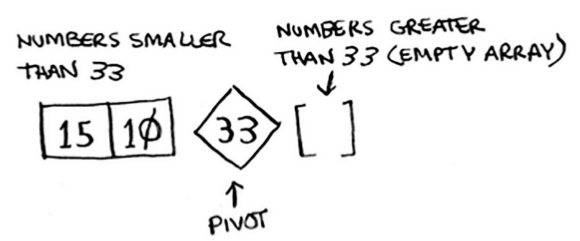
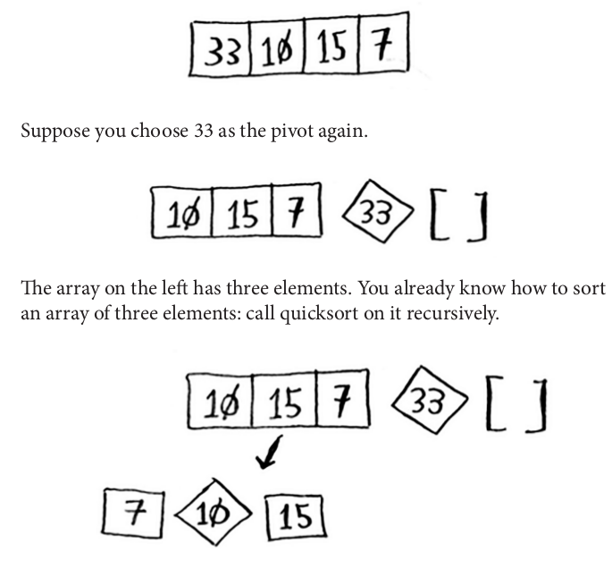

## Quicksort

- When you get a new problem, you don't have to be stumped. Instead, you can ask, "Can I solve this if I use divide and conquer?"

- Quicksort is an example of divide-and-conquer, and it is much more faster than selection sort.

- Binary search was also an example of divide-and-conquer. From this viewpoint, we can say that they are similar, since we split the problem into smaller parts.

- Lets use quicksort to sort an array. What is the simplest array that a sorting algorithm can handle? Well, some arrays don't need to be sorted at all, such as empty arrays and arrays with just one element will be the **base case**:

```python
def quicksort(array):
  if len(array) < 2:
    return array
```

- For arrays with more than 2 items, we have to pick an item from the array, we call it **pivot**.

- Now find the elements smaller than the pivot and the elements larger than the pivot:



- This is called **partitioning**. Now you have:

- A sub-array of all the numbers less than the pivot
- The pivot
- A sub-array of all the numbers greater than the pivot

The two sub-arrays aren’t sorted. They’re just partitioned. But if they were sorted, then sorting the whole array would be pretty easy.

If the sub-arrays are sorted, then you can combine the whole thing like this— left array + pivot + right array —and you get a sorted array.

How do you sort the sub-arrays? Well, the quicksort base case already knows how to sort arrays of two elements (the left sub-array) and empty arrays (the right sub-array).

What about an array of four elements?


