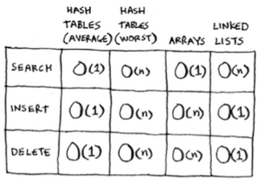
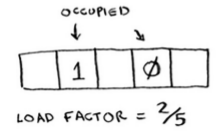
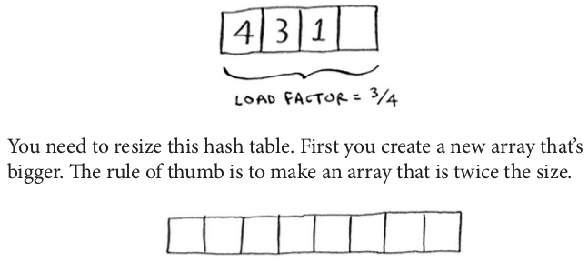
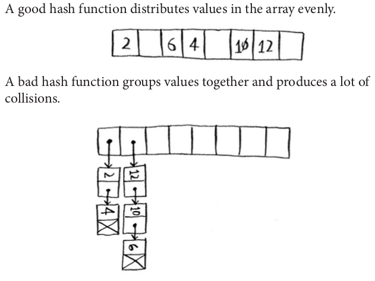
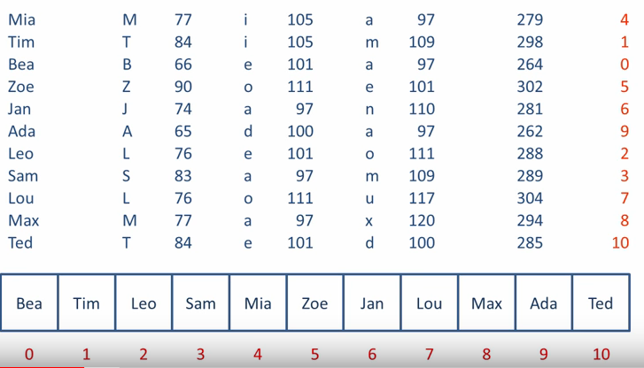

## Hash Tables

- A hash function is a function where you put in a string and you get back a number. In technical terminology, we’d say that a hash function "maps strings to numbers."

But there are some requirements for a hash function:

- It needs to be consistent. For example, suppose you put in "apple" and get back "4". Every time you put in "apple", you should get "4" back.
- It should map different words to different numbers. For example, a hash function is no good if it always returns "1" for any word you put in. In the best case, every different word should map to a different number.
 
 - Put a hash function and an array together, and you get a data structure called a **hash table**.

- Arrays and lists map straight to memory, but hash tables are smarter. They use a hash function to intelligently figure out where to store elements.A

- Hash tables are probably the most useful complex data structure you’ll learn. They’re also known as hash maps, maps, dictionaries, and associative arrays. And hash tables are fast! And hash tables use an array to store the data, so they're equally fast as arrays.

- You’ll probably never have to implement hash tables yourself. Any good language will have an implementation for hash tables. Python has hash tables; they’re called dictionaries. In Ruby they are named as Hash.

```python
phone_book = {}
phone_book[“jenny”] = 8675309
phone_book[“emergency”] = 911
```

## Using hash tables as a cache

- Another use case: caching. If you work on a website, you may have heard of caching before as a good thing to do.

- Caching has two advantages:

1. You get the web page a lot faster, just like when you memorized the distance from Earth to the Moon. The next time your niece asks you, you won't have to Google it. You can answer instantly.
1. The website has to do less work.

Caching is a common way to make things faster. All big websites use caching. And that data is cached in a hash!

```python
cache = {}

def get_page(url):
  if cache.get(url):
    return cache[url]
  else:
    data = get_data_from_server(url)
    cache[url] = data
  return data
```

## Recap

Hashes are good for:

- Modeling relationships from one thing to another thing
- Filtering out duplicates
- Caching/memorizing data instead of making your server do work

## Performance



- O(1) means it doesn’t matter whether your hash table has 1 element or 1 billion elements—getting something out of a hash table will take the same amount of time. Actually, you’ve seen constant time before. Getting an item out of an array takes constant time. It doesn’t matter how big your array is; it takes the same amount of time to get an element. In the average case, hash tables are really fast.

- Worst case is something like that for hashes:


- This is a collision situation. To avoid collisions, you need:

1. A low load factor
1. A good hash function

## Load factor

I'm going to talk about how to implement a hash table, but you’ll never have to do that yourself. Whatever programming language you use will have an implementation of hash tables built in. You can use the built-in hash table and assume it will have good performance. This section gives you a peek under the hood.

> Number of items in hash table / total number of slots



- Suppose you need to store the price of 100 produce items in your hash table, and your hash table has 50 slots. In the best case, each slot will have 2 items in it. Than we can say the load factor is 2.

- Having a load factor greater than 1 means you have more items than slots in your array. Once the load factor starts to grow, you need to add more slots to your hash table. This is called resizing. For example, suppose you have this hash table that is getting pretty full.



- The rule of thumb is to make an array that is **twice the size** when resizing.

- Now you need to re-insert all of those items into this new hash table using the hash function:


- This new table has a load factor of 3/8 . Much better! With a lower load factor, you’ll have fewer collisions, and your table will perform better. A good rule of thumb is, **resize when your load factor is greater than 0.7**.

- You might be thinking, "This resizing business takes a lot of time!" And you're right. Resizing is expensive, and you don't want to resize too often.



- What is a good hash function? That's something you'll never have to worry about—old men (and women) with big beards sit in dark rooms and worry about that.

## Recap

- You might soon find that you’re using them all the time:
- You can make a hash table by combining a hash function with an array.
- Collisions are bad. You need a hash function that minimizes collisions.
- Hash tables have really fast search, insert, and delete.
- Hash tables are good for modeling relationships from one item to another item.
- Once your load factor is greater than .07, it’s time to resize your hash table.
- Hash tables are used for caching data (for example, with a web server).
- Hash tables are great for catching duplicates.
- Hashing is widely used in database indexing, compilers, caching, password authentication, and more.

## Bonus: Linear Probing

- Collision'u engellemek için aynı array alanına birden çok veri denk gelirse bir sonraki hücre aranır ve boş bir yer bulunmaya çalışılır. Örneğin mod aldıktan sonra üçüncü hücreye koymak istedik veriyi ama orası doluydu. Dördüncüye bakarız, o da doluysa beş'e, o da doluysa altıya. Ne zaman ki boş yer bulursak o zaman veriyi oraya koyarız. Bu da yine linked list oluşturmak (buna da **chaining** deniyor) gibi bir collision engelleme yaklaşımı.


